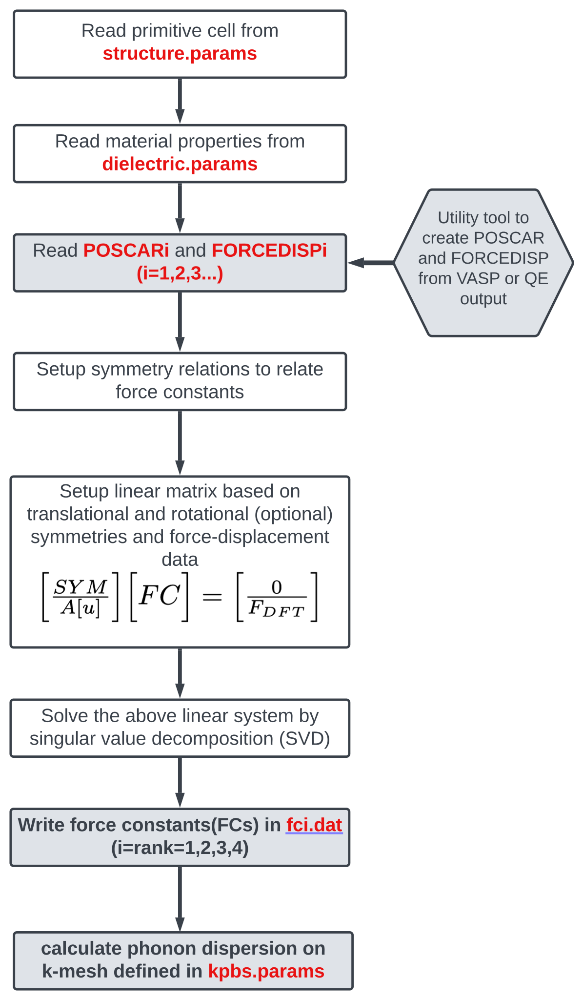

Running FOCEX
=============

Overview
--------

**FOCEX** (*FOrce Constant EXtraction*) takes a set of force–displacement data
computed in one or several supercells — typically by a DFT code such as VASP or
Quantum Espresso — and extracts from it the harmonic and anharmonic force
constants (FCs) of the crystal, defined as the derivatives of the potential
energy with respect to atomic displacements (see :doc:`theory`).

The extraction proceeds in three stages:

1. **Symmetry analysis.** From the primitive cell described in
   ``structure.params``, FOCEX finds the space-group operations of the crystal,
   builds the neighbor shells around each atom of the primitive cell, and
   determines which FCs of each requested rank are *irreducible* (independent).
   All remaining FCs are expressed as linear combinations of these.

2. **Linear fit by SVD.** Each snapshot in ``FORCEDISPi`` contributes
   :math:`3 N_{sc}` linear equations relating the DFT forces to the unknown
   irreducible FCs. Rows expressing translational (ASR), rotational and Huang
   invariance are added to this system, which is then solved in the
   least-squares sense by singular value decomposition.

3. **Post-processing.** From the fitted FCs, FOCEX computes the phonon band
   structure, group velocities, density of states, mode Gruneisen parameters,
   elastic and compliance tensors, sound speeds, Debye temperature, and
   quasi-harmonic thermodynamic properties (free energy, heat capacity,
   entropy, thermal expansion) over a temperature range.

The FCs written by FOCEX are also the input of the other ALATDYN codes
(``THERMACOND``, ``SCOP8``, ``ANFOMOD``).

.. note::

   Ranks up to 8 can be fitted, but only ranks 1–4 are written to ``fcN.dat``
   files. In practice ranks 2 (harmonic), 3 (cubic) and 4 (quartic) are the
   useful ones.

Workflow
--------

In words, a complete calculation consists of the following steps. Steps 1–3 are
done outside FOCEX and produce the two "data" files ``POSCAR1`` and
``FORCEDISP1``; steps 4–5 are the FOCEX run itself.

#. **Generate snapshots.** Use ``sc_snaps.x`` (in ``FOCEX/utility``) to build a
   supercell and a set of snapshots in which all atoms are displaced according
   to a canonical (thermal) distribution at a chosen temperature.
#. **Run the DFT code** on each snapshot to obtain the forces on every atom.
#. **Collect the results** into ``POSCAR1`` (equilibrium supercell) and
   ``FORCEDISP1`` (positions/displacements + forces + energy for every
   snapshot), using ``read_outcar.x`` / ``read_qe.x`` and the helper scripts.
#. **Prepare the five parameter files** ``structure.params``,
   ``dielectric.params``, ``latdyn.params``, ``kpbs.params`` and
   ``default.params``.
#. **Run FOCEX** in that directory. It writes the force constants, the phonon
   and thermodynamic properties, and a detailed log file.

If you want to use more than one supercell shape (recommended when you fit
cubic and quartic terms), repeat steps 1–3 for each shape and name the results
``POSCAR1``/``FORCEDISP1``, ``POSCAR2``/``FORCEDISP2``, …

.. _focex-quickstart:

Quick start: the Ge example
---------------------------

A complete, ready-to-run example is provided in ``FOCEX/example/Ge``. It uses a
216-atom supercell of germanium (:math:`3\times3\times3` of the 8-atom
conventional cubic cell, :math:`a = 5.7022565` Å) and 36 snapshots.

.. code-block:: bash

   # after compiling (see the Installation chapter)
   mkdir -p ~/runs/Ge && cd ~/runs/Ge
   cp <path-to-repo>/FOCEX/example/Ge/{structure.params,dielectric.params,latdyn.params,kpbs.params,default.params,POSCAR1,FORCEDISP1} .
   <path-to-your-binary>          # e.g.  ~/BIN/v16

On a single modern core the run takes a few minutes. It should end with

.. code-block:: text

   Program  FOCEX ended at ...

and produce, among others, ``fc2.dat``, ``fc2_irr.dat``, ``fc3.dat``,
``fc3_irr.dat``, ``bs_freq.dat``, ``ibz_dos.dat``, ``mech.dat``,
``thermo_QHA.dat`` and a log file whose name encodes the run settings (see
:ref:`focex-logname`).

The reference results for this example are:

.. code-block:: text

   number of configurations (snapshots)     36
   independent (irreducible) FC2 / FC3      78 / 95   (173 in total)
   translational / rotational / Huang       14 / 84 / 15  constraints
   fit quality  || F_dft - F_fit || / || F_dft ||   0.036 %
   C11, C12, C44 (GPa)                      121.1, 68.0, 47.4
   Bulk modulus (Hill, GPa)                 85.7
   Debye temperature (K)                    313.6

.. warning::

   The files shipped *next to* the example inputs (``fc2.dat``, ``log*.dat``,
   ``svd-all.dat``, …) were produced by an older version of the code; their
   numbers and, for the FC files, their column layout differ slightly from what
   the current version writes. Trust a fresh run rather than the stored output.

Preparing the DFT data
----------------------

Generating the snapshots (``sc_snaps.x``)
^^^^^^^^^^^^^^^^^^^^^^^^^^^^^^^^^^^^^^^^^

``sc_snaps.x`` builds a supercell from the primitive cell and writes a set of
POSCAR-format snapshots in which *all* atoms are displaced simultaneously,
sampled from a classical canonical distribution at temperature ``T`` along the
normal modes of a simple model potential. Displacing all atoms at once (rather
than one atom at a time) makes far better use of each expensive DFT run.

It reads three small input files, all of which live in ``FOCEX/utility``:

``cell.inp`` — the primitive/conventional cell

.. code-block:: text

   1 1 1   90 90 90                # conventional cell a,b,c,alpha,beta,gamma
   0 0.5 0.5 0.5 0 0.5 0.5 0.5 0   # primitive vectors R01,R02,R03 in units of the conventional cell
   5.                              # length scale of the lattice parameters (Ang)
   2                               # number of atom types
   1   1                           # number of atoms of each type
   23  35.45                       # mass of each type (uma)
   Na Mg                           # names of the types
   0 0 0                           # reduced coordinates (conventional units) of atom 1
   0 0 0.5                         # ... of atom 2

``supercell.inp`` — the supercell, in units of the **conventional** cell vectors

.. code-block:: text

   3 0 0     # supercell vectors in terms of the conventional cell vectors
   0 3 0
   0 0 3

``snaps.inp`` — the sampling parameters

.. code-block:: text

   500    # average/typical phonon frequency (1/cm); 500/cm = 15 THz
   300    # temperature (K) for the canonical sampling of displacements
   15     # number of snapshots (20-50 is usually plenty)

Running ``sc_snaps.x`` produces

* ``poscar_000`` — the **undistorted** supercell,
* ``poscar_001`` … ``poscar_0nn`` — the displaced snapshots,
* ``snapshots.xyz``, ``SC.xyz`` — the same information for visualisation,
* ``log.dat``, ``freqs.dat``, ``modes.dat`` — diagnostics of the model
  normal modes used for the sampling.

Each ``poscar_0nn`` is a VASP POSCAR in Cartesian coordinates; the last three
columns are the sampled velocities and are ignored by VASP.

.. tip::

   How many snapshots do you need? The fit needs at least as many force
   components (:math:`3 N_{sc}` per snapshot) as there are independent FCs, and
   comfortably more for a stable least-squares solution. The Ge example uses
   36 snapshots × 648 force components = 23 328 equations for 173 unknowns.
   Start with 10–20 snapshots and add more if the singular values reported in
   ``svd-all.dat`` become small or the fit error is large.

.. note::

   The description above is of the copy bundled in ``FOCEX/utility``, which is
   older than the standalone release. SC-SNAPS is now developed in its own
   repository and comes with a graphical interface; its current input format
   differs (line 3 of ``cell.inp`` takes two values, line 6 takes masses and
   charges). See :doc:`runscsnaps`.

Running the DFT code
^^^^^^^^^^^^^^^^^^^^

Run a *single-point* (no relaxation) force calculation on each snapshot.
Accurate forces matter: use a well-converged k-mesh and plane-wave cutoff, and
tight electronic convergence, since the FCs are obtained by differentiating
these forces.

``FOCEX/utility/runall.sh`` shows the pattern for VASP:

.. code-block:: bash

   for x in poscar_*
   do
     cp $x POSCAR
     mpirun -np 8 vasp_std
     read_outcar.x                    # writes pos-forc.dat from OUTCAR
     cat pos-forc.dat >> FORCEDISP1   # append this snapshot
   done

``runall-slurm.sh`` is the equivalent for a Slurm cluster.

Building ``POSCARi`` and ``FORCEDISPi``
^^^^^^^^^^^^^^^^^^^^^^^^^^^^^^^^^^^^^^^

**POSCAR1** holds the *equilibrium* atomic positions of the supercell. It is the
undistorted snapshot ``poscar_000`` (or the POSCAR you used to build the
snapshots) **with the line containing the element names removed** — FOCEX
expects the older VASP-4 POSCAR layout, in which the counts of atoms of each
type follow the third lattice vector directly:

.. code-block:: bash

   sed '6d' poscar_000 > POSCAR1     # delete the "Na Mg" (element names) line

**FORCEDISP1** is the concatenation of the per-snapshot force/position blocks.
Two converters are provided in ``FOCEX/utility``:

* ``read_outcar.x`` reads the file named ``OUTCAR`` in the current directory and
  writes ``pos-forc.dat``;
* ``read_qe.x`` does the same for a Quantum Espresso (PWSCF) output file, whose
  name it expects on standard input:

  .. code-block:: bash

     echo pw.out | read_qe.x

Both write format A below, converting to Å and eV/Å as needed. One ``OUTCAR``
may contain several ionic steps; each becomes one snapshot.

Either can be driven by the shell scripts ``xtract.sh`` (loops over ``OUTCAR*``
files in one directory) or ``process_dft.sh`` (walks a directory tree looking
for ``OUTCAR`` files). Both simply concatenate the resulting ``pos-forc.dat``
files into ``FORCEDISP1``; adapt them to your directory layout.

.. _focex-poscar:

Format of ``POSCARi``
^^^^^^^^^^^^^^^^^^^^^

.. code-block:: text

   This line is a comment and ignored           <- line 1: free-form comment
    1.000000                                    <- scale factor (see note)
      17.1067694871620333    0.0000000000    0.0000000000    <- supercell vector 1
       0.0000000000   17.1067694871620333    0.0000000000    <- supercell vector 2
       0.0000000000    0.0000000000   17.1067694871620333    <- supercell vector 3
     216                                        <- number of atoms of each type (one integer per type)
   Direct                                       <- "Direct"/"D" or "Cartesian"/"C"
       0.0000000000    0.0000000000    0.0000000000
       0.0000000000    0.0000000000    0.3333333333
       ...                                      <- one line per atom

Notes:

* There is **no element-name line**: line 6 must contain ``natom_type``
  integers, in the same order as the types declared in ``structure.params``.
* The scale factor multiplies the three lattice vectors (and Cartesian atomic
  positions). A *negative* value is interpreted, as in VASP, as minus the
  volume of the cell.
* A ``Selective dynamics`` line before the coordinate flag is tolerated.
* Extra columns after the three coordinates (element labels, velocities) are
  ignored.
* FOCEX checks that the volume per atom of the supercell matches that of the
  primitive cell declared in ``structure.params`` and stops if they differ.

.. _focex-forcedisp:

Format of ``FORCEDISPi``
^^^^^^^^^^^^^^^^^^^^^^^^

Each snapshot is one block. Two block formats are recognised; a file may not
mix them.

**Format A — "POSITION" (recommended).** This is what ``read_outcar.x`` and
``read_qe.x`` write. Positions are absolute Cartesian coordinates in Å, forces
in eV/Å:

.. code-block:: text

   # POSITION (Ang)     TOTAL FORCE (eV/Ang)         <- must contain the word POSITION
        1       -289.18629538 =t, Etot(eV)           <- snapshot index, total energy (eV)
     2.89296000   0.00000000   2.88142999   -0.11758300  -0.00000000  -0.00000000
     2.88142999   0.00000000   8.64428999    0.00049600  -0.00000000  -0.00000000
     ...                                             <- exactly N_sc lines, in POSCARi order
        2       -289.1953     =t, Etot(eV)           <- snapshot index, total energy (eV)
     2.89396000   0.00400000   2.88342999   -0.11758300  -0.00000000  -0.00000000
     2.85142999   0.02000000   8.67428999    0.00049600  -0.00000000  -0.00000000
     ...                                             <- exactly N_sc lines, in POSCARi order

The first line of a block is recognised by the word ``POSITION``; the second
line must contain an integer followed by the total energy of that snapshot in
eV; then come exactly :math:`N_{sc}` lines of ``x y z Fx Fy Fz``. The atoms must
appear in the same order as in ``POSCARi``. FOCEX subtracts the equilibrium
positions itself and folds the resulting displacement back into the supercell,
so wrapped/unwrapped coordinates are both fine.

**Format B — "vasprun".** Used by the shipped Ge example. The header line must
contain the word ``vasprun`` and the substring ``(eV):`` followed by the energy;
the following :math:`N_{sc}` lines contain **displacements** (not absolute
positions) and forces:

.. code-block:: text

   # Filename: vasprun1.xml, Snapshot: 1, E_pot (eV): -1057.32911508
         0.0188971    0.0000000    0.0000000   -4.24665168E-03  0.0  0.0
         0.0000000    0.0000000    0.0000000    7.67997159E-06  ...
         ...

The displacements are multiplied internally by 0.529177 and the forces by
27.2116 before use (i.e. displacements are read in Bohr). Prefer format A for
new work: its units are unambiguous.

.. note::

   Energies are only used when the Boltzmann weighting of snapshots is switched
   on (``itemp = 1`` in ``structure.params``). FOCEX subtracts the lowest energy
   of the first file and normalises by the number of atoms, so the absolute
   reference is irrelevant. Even when the weighting is off, the energy column
   must be present and parsable.

Input files
-----------

Five parameter files must be present in the run directory, next to
``POSCARi``/``FORCEDISPi``. All of them are read by list-directed (free-format)
Fortran ``read`` statements: **only the leading numbers of each line matter**,
and anything after them on the same line is treated as a comment. The *number
and order of the lines is fixed* — do not insert or delete lines.

.. _focex-structure-params:

``structure.params``
^^^^^^^^^^^^^^^^^^^^

The main input file: it describes the primitive cell, the range of the FCs and
the options of the fit.

.. code-block:: text

   1 1 1 90 90 90                 #  1  a,b,c,alpha,beta,gamma of the CONVENTIONAL cell
   0 0.5 0.5  0.5 0 0.5  0.5 0.5 0  # 2  primitive vectors in units of the conventional cell
   5.7022565                      #  3  scale factor multiplying a,b,c (Ang)
   1 1 1 0 0 0 0 0                #  4  include ranks 1...8 in the fit (0=no, 1=yes, 2=read)
   1 1 0 0                        #  5  itrans, irot, ihuang, enforce_inv
   0 300                          #  6  itemp(0=no temperature weighting), tempk
   1 .false.                      #  7  number of FORCEDISP/POSCAR file pairs, verbosity
   1                              #  8  number of atom types
   72.64                          #  9  mass of each type (uma)
   Ge                             # 10  name of each type
   2                              # 11  number of atoms in the primitive cell
   0                              # 12  fc2range (0=default covers all the largest supercell)
   11 11                          # 13  neighbor shells for rank 2, ONE PER ATOM of the prim. cell(if fc2range>0)
   3 3                            # 14  neighbor shells for rank 3
   0 0                            # 15  neighbor shells for rank 4
   0 0                            # 16  neighbor shells for rank 5
   0 0                            # 17  neighbor shells for rank 6
   0 0                            # 18  neighbor shells for rank 7
   0 0                            # 19  neighbor shells for rank 8
   1 1 0    0    0                # 20  atom 1: index, type, reduced coordinates (CONVENTIONAL units)
   2 1 0.25 0.25 0.25             # 21  atom 2: index, type, reduced coordinates

Line by line:

**1. Conventional cell** — ``a b c alpha beta gamma``. The lengths are
multiplied by the scale factor of line 3; the angles are in degrees.

**2. Primitive lattice** — nine numbers, read as three groups of three: the
Cartesian-free components of :math:`R_{01}, R_{02}, R_{03}` expressed in units
of the conventional cell vectors. For the FCC example above,
:math:`R_{01} = (0, a/2, a/2)`. Use ``1 0 0 0 1 0 0 0 1`` if your conventional
cell *is* the primitive cell.

**3. Scale factor** — multiplies ``a``, ``b`` and ``c``. It must be consistent
with ``POSCARi``: FOCEX compares the volume per atom of both cells and stops on
a mismatch.

**4. Ranks to include** — eight flags, for ranks 1 to 8:

  * ``0`` — this rank is excluded from the model;
  * ``1`` — this rank is fitted;
  * ``2`` — this rank is read from an existing ``fcN_irr.dat`` instead of being
    fitted (experimental — check the log carefully if you use it).

  Rank 1 (the residual force :math:`\Pi`) should normally be included: it is
  zero only if the reference structure is exactly at its energy minimum.

**5. Invariance flags** — ``itrans irot ihuang enforce_inv``. The first three
are ``1`` to switch the constraint on, ``0`` off; ``enforce_inv`` selects how
the fit is solved and takes the values 0, 1 or 2.

  * ``itrans`` — translational invariance (acoustic sum rule). Keep it on;
    without it the acoustic branches will not go to zero at :math:`\Gamma`.
  * ``irot`` — rotational invariance. Relates rank :math:`n` to rank
    :math:`n+1`; useful when several ranks are fitted together.
  * ``ihuang`` — Huang : makes sure elastic tensor is symetric ; needed for low-symmetry crystals.
  * ``enforce_inv`` — see :ref:`focex-enforce-inv` just below.

.. _focex-enforce-inv:

Choosing ``enforce_inv``
^^^^^^^^^^^^^^^^^^^^^^^^

``enforce_inv`` decides how the invariance relations are imposed and how the
force constants are solved for. The three settings solve genuinely different
problems.

.. list-table::
   :header-rows: 1
   :widths: 8 92

   * - Value
     - What it does
   * - ``0``
     - The invariance relations are appended as extra rows of the
       force-displacement system and the whole thing is solved by SVD. The
       invariances are then satisfied only in the least-squares sense. This is
       the default and the usual choice.
   * - ``1``
     - The force equations are fitted *subject to* the invariances, by working
       in the kernel of the constraint matrix. The invariances hold **exactly**.
   * - ``2``
     - As ``1``, but the reduced problem is solved by LASSO, which also decides
       which force constants the data actually supports. See below.

**How ``1`` works.** The invariance relations are homogeneous, so the force
constants that satisfy them all form a linear subspace. If ``K`` is an
orthonormal basis of that subspace — the kernel of the constraint matrix — then
writing :math:`x = K y` satisfies every invariance identically, whatever
:math:`y` is. FOCEX then fits the free parameters :math:`y`, and recovers all
the force constants from :math:`x = K y`. ``K`` is the elimination of the
dependent force constants written in a well-conditioned basis, so no separate
back-substitution step is needed.

The number of free parameters is the dimension of that kernel, which is printed
in the log as ``Kernel of A, ... is of dimension``. It can be much smaller than
the number of force constants: for a 122-parameter MoTe2 model with all three
invariances on, 87 of the relations are independent and only 35 free parameters
remain. If that number is very small, the invariances are over-determining your
model, and the fit will be poor no matter how good the data — increase the
range, or switch some of ``irot``/``ihuang`` off.

.. note::

   Before version 8.17, ``enforce_inv = 1`` solved the unconstrained problem and
   then orthogonally projected the answer onto the kernel. That is not the same
   as fitting under the constraint and could be far worse. Numbers produced with
   ``enforce_inv = 1`` by an earlier version should be regenerated.
   ``enforce_inv = 0`` is unaffected.

.. _focex-lasso:

``enforce_inv = 2``: selecting the force constants by LASSO
^^^^^^^^^^^^^^^^^^^^^^^^^^^^^^^^^^^^^^^^^^^^^^^^^^^^^^^^^^^

With ``enforce_inv = 2`` the reduced problem is solved by minimising

.. math::
   \frac{1}{2}\, \| A x - b \|^2 \;+\; \mu \sum_j n_j \, |x_j|

instead of by SVD. The second term is an :math:`L_1` penalty, with :math:`n_j`
the norm of column :math:`j` so that the penalty does not depend on the units of
each rank — ranks 2, 3 and 4 carry different powers of Ångström.

**What it is for.** An :math:`L_1` penalty drives parameters to *exactly* zero
rather than merely making them small. When you request many neighbour shells or
high ranks, the number of candidate force constants grows quickly and most of
them are not determined by the data. Least squares then distributes small,
noise-driven values over all of them, which fits the snapshots you have and
predicts everything else badly. The :math:`L_1` term instead keeps only the
force constants the data supports.

**When it helps, and when it does not.** It matters when the model is
underdetermined — a long range, high ranks, or few snapshots. It is close to
harmless otherwise. Two measured examples:

.. list-table::
   :header-rows: 1
   :widths: 34 16 16 34

   * - Case
     - free params
     - equations
     - result
   * - MoTe2, FC2 to 25 shells, FC3 to 10, **2 snapshots**
     - 880
     - 1152
     - SVD uses all 880 and gives phonons from −15030 to 14820 cm\ :sup:`-1`;
       LASSO keeps **88** and gives −242 to 268 cm\ :sup:`-1`
   * - GeSe, **well determined**
     - 795
     - 2880
     - LASSO keeps **789 of 795** and reproduces the SVD phonons to 0.4 cm\ :sup:`-1`

In the first case the SVD has the *better* residual on the data it was fitted to
— 13.9 % against 36.8 % — and phonons three orders of magnitude beyond anything
physical. That is what overfitting looks like, and it is why the residual on the
training data is not a useful measure of a fit.

**You do not choose** :math:`\mu`. FOCEX selects it by five-fold
cross-validation: the force rows are split into five groups, and for each
candidate :math:`\mu` the model is fitted on four groups and its error measured
on the fifth, each group being held out once. The :math:`\mu` that minimises the
error on data the fit never saw is the one used. Forty values of :math:`\mu` are
scanned, from the smallest value that zeroes every coefficient down by four
orders of magnitude. The whole scan is written to ``lasso.dat``, and the
selected value appears in the log as ``LASSO: selected mu``.

.. tip::

   Check ``LASSO: non-zero free parameters`` in the log. If it is close to the
   total, the data already determines your model and ``enforce_inv = 0`` or
   ``1`` will do the same job more cheaply. If it is a small fraction, the
   :math:`L_1` term is doing real work and the SVD result should be treated with
   suspicion.

.. note::

   The sparsity is in the free parameters, not in the force constants
   themselves: the retained parameters are combinations :math:`x = K y`, so the
   printed ``fcN.dat`` files are not themselves sparse.

**6. Temperature weighting** — ``itemp tempk``. With ``itemp = 0`` every
snapshot has the same weight (``tempk`` is then unused but must be present).
With ``itemp = 1`` snapshots are weighted by the Boltzmann factor
:math:`e^{-E/k_B T}` at ``tempk`` (K), using the energies read from
``FORCEDISPi``. Use ``0`` unless you know you want the weighting.

**7. Data files and verbosity** — ``fdfiles verbose``. ``fdfiles`` is the number
of supercell shapes, i.e. of ``POSCARi``/``FORCEDISPi`` *pairs*
(``i = 1 … fdfiles``); it must be a single digit. ``verbose`` is a Fortran
logical (``.true.``/``.false.``); ``.true.`` writes the fit matrices to
``amatrx.dat`` and adds per-snapshot dumps to the log — very large files, use it
only for debugging.

**8–10. Atom types** — the number of distinct elements, then their masses (uma)
and names, in the *same order as the atom counts in* ``POSCARi``.

**11. Atoms in the primitive cell** — the *total* number of atoms in the
primitive cell (not per type).

**12.** ``fc2range`` — how the range of the harmonic FCs is chosen:

  * ``0`` — automatic: the range is the largest sphere that fits in the
    Wigner-Seitz cell of the biggest supercell provided, and the shell counts on
    line 13 are overwritten accordingly. This is the safe default.
  * ``1`` — use the shell counts of line 13; any shell reaching beyond the
    supercell is still discarded, with a warning in the log.

**13–19. Neighbor shells** — one line per rank (2 … 8), each containing
``natom_prim_cell`` integers: how many neighbor shells around each atom of the
primitive cell are included for that rank. ``0`` means "no FC of this rank on
this atom". Ranks whose flag on line 4 is ``0`` are ignored, but their line must
still be present. The radius of each shell is listed in the log file and in
``pairs.dat``, so you can convert shells to Å after a first run.

**20…** — one line per atom of the primitive cell: ``index type x y z``, where
the index must run 1, 2, 3 … in order, ``type`` refers to lines 8–10, and
``x y z`` are **reduced coordinates in units of the conventional cell vectors**
(not the primitive ones).

.. tip::

   Convergence with respect to range is the main physical approximation in
   FOCEX. Increase the number of harmonic shells until the phonon dispersion
   stops changing, and check that the cubic/quartic shells you request are
   really sampled by your supercell — one shell for rank 4 and two or three for
   rank 3 is a common, economical starting point.

``dielectric.params``
^^^^^^^^^^^^^^^^^^^^^

Long-range electrostatics. Required even for non-polar crystals, in which case
only the first line matters.

.. code-block:: text

   0                                    # born_flag (0 to exclude NA corrections)
   15.842   0.000   0.000               # dielectric tensor epsilon (3 lines)
    0.000  16.455   0.000
    0.000   0.000  16.638
   0 0 0                                # Born effective charge tensor of atom 1 (3 lines)
   0 0 0
   0 0 0
   0 0 0                                # Born effective charge tensor of atom 2
   0 0 0
   0 0 0

* ``born_flag = 0`` — Born charges are ignored (correct for non-polar crystals
  such as Si, Ge, and the simplest choice to start with ; no LO-TO splitting).
* ``born_flag = 1`` — nothing is subtracted from the DFT forces, but the
  non-analytical (Parlinski) term is added to the dynamical matrix.
* ``born_flag = 2`` — the Ewald force is subtracted from the input forces before
  the fit, so that the fitted FCs are purely short-ranged, and the
  non-analytical term is added back when the dynamical matrix is built. This is
  the recommended setting for polar materials.
* ``born_flag = 3, 4, 6, 7, 8, 9`` — variants of the subtraction scheme intended
  for development and testing; the log file states which one is active.

There must be exactly ``natom_prim_cell`` Born-charge blocks, in the order in
which the atoms are declared in ``structure.params``. The acoustic sum rule is
imposed on the charges automatically (the excess is spread equally over the
atoms), and the ASR-corrected values are echoed to the log.

``latdyn.params``
^^^^^^^^^^^^^^^^^

Controls the Brillouin-zone sampling and the thermodynamic post-processing.

.. code-block:: text

   12 12 12          # 1  k-mesh (n1,n2,n3) for BZ integrations
   0 0 0  1 0 0      # 2  shift of the mesh (fractions of a mesh step); normal direction
   300 350.0         # 3  number of frequency points for the DOS; omega_max (1/cm)
   10                # 4  Gaussian broadening of the DOS (1/cm)
   .False.           # 5  (read but not used; verbosity is set in structure.params)
   0 900             # 6  Tmin, Tmax (K) range for the thermodynamic properties
   0                 # 7  0 = quantum (Bose-Einstein), 1 = classical occupations

Line 2 contains **six** numbers: the three components of the mesh shift followed
by the three components of a unit vector used as the surface normal for the
mode-counting/conductance and optical outputs. A missing normal is
the most common cause of a crash in this file.

The temperature loop runs from ``Tmin`` to ``Tmax`` with a step of 2 K below
40 K, 5 K below 150 K and 50 K above (about 30 temperatures for 0–900 K); any
third number on line 6 is ignored.

``kpbs.params``
^^^^^^^^^^^^^^^

The k-point path for the phonon band structure.

.. code-block:: text

   0             # 1  units: 0 = reduced coordinates of the CONVENTIONAL reciprocal cell,
                 #           1 = reduced coordinates of the PRIMITIVE reciprocal cell
   40            # 2  number of k-points along each segment
   7             # 3  number of segments (directions)
   X 0    1    1        # name and coordinates of the start of segment 1
   K 0    0.75 0.75     # end of segment 1 / start of segment 2
   G 0    0.   0.0001   # ...
   X 1    0    0
   L 0.5  0.5  0.5
   W 0.   0.5  1
   U 0.25 0.25 1
   G 0    0.   0.0001   # end of segment 7

There must be exactly ``number of segments + 1`` k-point lines: the path is
continuous, and each line is both the end of one segment and the start of the
next. The label is a short string used for the tick marks in ``KTICS.BS`` file used for plotting.

.. tip::

   Give :math:`\Gamma` a tiny offset (``0 0 0.0001``) as in the example above.
   Exactly at :math:`q = 0` the non-analytical term of a polar crystal is
   direction-dependent and undefined, and degeneracies make band sorting
   ambiguous.

``default.params``
^^^^^^^^^^^^^^^^^^

Numerical thresholds and array-size limits. **A zero on any line means "use the
built-in default"**, which is what the comment on that line states — so in
practice you copy this file unchanged and never touch it. It has 36 lines, in
this order: tolerance, force error, neighbor-cell cutoff, margin, then
``maxterms(1:8)``, ``maxtermzero(1:8)``, ``maxtermsindep(1:8)`` and
``maxgroups(1:8)``.

.. code-block:: text

   0      tolerance for equating to zero (2d-3)      # if 0 take the default value
   0      force error value for inversion/regularization (1d-5)
   0      cutoff for how many cells away (6 cells) to include when making neighborlists
   0      margin for eliminating small force constants (1d-6)
   0      maxterms(1)=40
   ...

The four meaningful knobs are:

* **tolerance** (default :math:`10^{-4}` Å) — two coordinates closer than this
  are considered equal when identifying symmetry-equivalent atoms. Increase it
  if a slightly distorted or loosely converged structure makes FOCEX miss
  symmetry operations.
* **force error** (default :math:`10^{-5}`) — the estimated noise level of the
  DFT forces. Its square is used as the SVD cutoff: singular values smaller than
  ``w_max × force_error²`` are discarded in the inversion.
* **cutoff** (default 6) — how many cells away neighbors are searched for; it
  sets the size of the internal ``atompos`` list.
* **margin** (default :math:`10^{-6}`) — FCs smaller than this are not written
  to the ``fcN.dat`` files.

The ``maxterms``/``maxgroups`` entries are upper bounds on the number of terms
and groups stored per rank. If a run stops complaining that one of these is too
small, raise the corresponding line for that rank.

Running FOCEX
-------------

FOCEX takes no command-line argument and reads no standard input: put all the
input files in one directory, ``cd`` into it and run the binary.

.. code-block:: bash

   cd my_material
   ls
   # default.params  dielectric.params  kpbs.params  latdyn.params
   # structure.params  POSCAR1  FORCEDISP1
   ~/BIN/v16 | tee focex.out

The run is serial and memory-bound: the largest array is the fit matrix, of
size (number of force components + constraints) × (number of independent FCs).
The Ge example builds a 23 441 × 173 matrix and needs a few minutes and well
under 1 GB.

.. _focex-logname:

The log file name
^^^^^^^^^^^^^^^^^

The log file records the settings of the run in its own name, so that runs with
different ranges or options do not overwrite each other:

.. code-block:: text

   log 1 df B00 _ 00_03_0 _ tr00 .dat
       |  |   |     |         |
       |  |   |     |         +-- imposed invariances: t=transl, r=rot, h=Huang, E=enforced
       |  |   |     +------------ shells used for ranks 2, 3 and 4 (00 = default/not fitted)
       |  |   +------------------ B + born_flag
       |  +---------------------- df = default FC2 range, rd = range read from structure.params
       |                          Td / Tr = same, with Boltzmann weighting (itemp=1)
       +------------------------- number of FORCEDISP files

Output files
------------

Force constants
^^^^^^^^^^^^^^^

``fcN_irr.dat`` (N = 1…4)
    The **irreducible** (independent) force constants of rank N — the actual
    output of the fit. Everything else can be regenerated from these by
    symmetry.

``fcN.dat`` (N = 1…4)
    The **full** set of force constants of rank N, i.e. every symmetry-related
    term reconstructed from the irreducible ones. This is the file consumed by
    ``THERMACOND``, ``SCOP8`` and ``ANFOMOD``.

Units are eV/Å\ :sup:`N`: eV/Å for rank 1, eV/Ų for the harmonic FCs, eV/ų for
the cubic ones and eV/Å⁴ for the quartic ones.

Both files use the same layout (``fcN.dat`` has one extra header line). A line
of ``fc2_irr.dat`` looks like this:

.. code-block:: text

   # RANK   2  tensors :term,group,(iatom,ixyz)_2 d^nU/dx_{i,alpha}^n
        1     1      1 1      2 1    -2.853242    2.4691   2  0  0  0  -0.2500 -0.2500 -0.2500

and its fields are, from left to right:

#. index of the term inside its group;
#. index of the group — a group is a set of FCs related to each other by
   symmetry, with one or a few independent members;
#. ``rank`` pairs of (atom index, Cartesian direction), here ``1 1`` and
   ``2 1``, i.e. :math:`\Phi^{xx}` between atom 1 and atom 2. The direction is
   1 = x, 2 = y, 3 = z; the atom indices refer to the neighbor list written in
   ``lat_fc.dat``;
#. the value of the force constant;
#. the pair distance :math:`|r_i - r_j|` in Å (rank 2 only; zero for the other
   ranks);
#. for atoms 2 … rank, the quadruplet :math:`(\tau, n_1, n_2, n_3)` giving the
   atom's index in the primitive cell and the cell it belongs to, in units of
   the primitive translation vectors;
#. rank 2 only: the three components of :math:`r_i - r_j` in units of the
   conventional cell vectors.

``lat_fc.dat``
    The structural information that goes with the FCs: primitive translation
    vectors, atoms of the primitive cell, which ranks were included, the shell
    counts actually used, the number of groups and terms per rank, and the
    Cartesian coordinates of every neighbor atom referred to by the ``fcN.dat``
    files. **The other ALATDYN codes read this file together with the**
    ``fcN.dat`` **files.** ``lat0_fc.dat`` is the same information before the
    range of FC2 is trimmed to the supercell.

``trace_fc.dat``
    Trace of the harmonic FC tensor for every pair, versus pair distance — the
    quickest way to see how fast the harmonic interaction decays and whether
    your range is sufficient. Plot it with ``fcs.plt``.

``bond_fci.dat``, ``springs1.dat``, ``springs2.dat``, ``pairs.dat``
    The pairs connected by FC2, and the shell radii and their multiplicities,
    for inspection and plotting.

Phonons and thermodynamics
^^^^^^^^^^^^^^^^^^^^^^^^^^

``bs_freq.dat``
    Band structure along the ``kpbs.params`` path: ``nk, nb, dk, k(3),
    frequency (1/cm), velocity(3) (km/s), |velocity|``, one line per (k-point,
    band).

``bands.dat``
    The same data with all bands of a k-point on one line — convenient for
    plotting: ``index, dk, kx, ky, kz``, then the :math:`3 N_{prim}`
    **eigenvalues** :math:`\omega^2` (in eV/Ų/uma — multiply the square root by
    521.11 to get cm\ :sup:`-1`, which is what ``bandgen.plt`` does), then the
    :math:`3 N_{prim}` group-velocity magnitudes in km/s.
    ``KTICS.BS`` contains a ready-made gnuplot ``set xtics`` command with the
    labels and positions of the special points, and ``KPOINT.BS`` the
    coordinates of the path in the three conventions.

``ibz_bands.dat``
    Frequencies and velocities on the irreducible wedge of the ``latdyn.params``
    mesh.

``ibz_dos.dat`` / ``fbz_dos.dat``
    Phonon density of states, from a Gaussian smearing over the irreducible
    wedge and from the tetrahedron method over the full zone, respectively.
    Columns: ``omega (1/cm), index, integrated DOS, total DOS, then the
    per-branch DOS``.

``bs_grun.dat`` / ``ibz_grun.dat``
    Mode Gruneisen parameters along the path and in the irreducible wedge
    (written only when rank 3 is included).

``mech.dat``
    Mechanical properties: the :math:`\Phi`, :math:`\zeta`, :math:`\Xi` tensors,
    the elastic tensor (GPa, Voigt 6×6), the compliance tensor, the residual
    strain and internal displacements, then the Voigt/Reuss/Hill bulk and shear
    moduli, Young modulus, Poisson ratio, anisotropy ratio, sound velocities and
    Debye temperature.

``thermo_QHA.dat``
    Quasi-harmonic thermodynamics versus temperature, one line per temperature:
    ``T(K), E_eq(kJ/mol), F_eq(kJ/mol), V_eq/V0, strain, Cv, Cp(J/K/mol),
    S(J/K/mol), linear CTE(1/K), Gruneisen, B(T)/B(0)``.

``temp_free.dat``
    The free energy versus strain curve at each temperature that is minimised to
    produce ``thermo_QHA.dat`` — useful to check that the minimum is well inside
    the scanned strain range.

``chi_real.dat`` / ``chi_imag.dat``
    Real and imaginary parts of the dielectric response versus frequency, plus
    the refractive index ``n`` and extinction coefficient ``k``.

``conductance.dat``
    Mode-counting (ballistic conductance) along the ``normal`` direction of
    ``latdyn.params``. The band loop that fills it is currently disabled in the
    source, so in this version the file is written but contains only zeros.

Diagnostics
^^^^^^^^^^^

``log*.dat``
    The main log. Everything the code decided — symmetry operations, neighbor
    shells and their radii, the number of independent FCs per rank, the number
    of constraints of each type, the fit error, the invariance violations of the
    final solution — is here. **Read it after every run.**

``svd-all.dat`` (``enforce_inv = 0``) or ``svd-kernel.dat`` (``enforce_inv = 1``)
    The singular values of the fit matrix, its condition number, the cutoff
    applied, the solution with its error bars, the residual ``Ax-b`` for every
    equation, and the summary line ``MAE, largest errors in force(eV/Ang),
    percent deviation``. With ``enforce_inv = 1`` the matrix is the reduced one,
    so there are as many singular values as there are free parameters.

``lasso.dat`` (``enforce_inv = 2`` only)
    The cross-validation scan used to pick :math:`\mu`: one line per value of
    :math:`\mu` with the mean cross-validation error and its standard error,
    preceded by per-fold diagnostics giving the iteration count and the number
    of non-zero parameters along the path. Plot column 3 against column 2 to see
    the error curve and where it turns over. See :ref:`focex-lasso`.

``times.dat``
    Wall/CPU time after each stage of the run — the place to look when a run
    seems stuck.

``maps.dat``, ``corresp.dat``, ``amatrx.dat``, ``matrix_svd-all.dat``, ``symmetry.dat``, ``elimination.dat``
    Internal tables (symmetry mapping of the FCs, the fit matrix itself, the U
    and V matrices of the SVD, the space-group operations, the kernel used to
    enforce invariances). They can be very large and are only needed for
    debugging.

``atompos.xyz``, ``poscar.xyz``, ``primlatt.xyz``, ``supercell_*.xyz``, ``latfc.xyz``, ``rgrid*.xyz``, ``ggrid*.xyz``, ``WS*_boundary.xyz``
    Structures, real- and reciprocal-space grids and Wigner-Seitz cell
    boundaries in ``.xyz`` format, for visualisation (VMD, OVITO, gnuplot).

Checking the quality of the fit
-------------------------------

After a run, look at these numbers, in this order:

#. **The relative fit error**, in the log and at the end of ``svd-all.dat``:

   .. code-block:: text

      Percent error, || F_dft-F_fit || / || F_dft || =    0.036 %
      MAE, largest errors in force(eV/Ang),percent deviation=  0.287E-05  0.154E-03  0.361E-01

   A few percent is normal for a well-converged model; tens of percent means the
   range or the ranks are insufficient (or the snapshots are too anharmonic for
   the truncation).

#. **The singular values** at the top of ``svd-all.dat``, and the condition
   number printed just below them. A very large condition number means some
   combinations of FCs are not constrained by your data — add snapshots, add a
   second supercell shape, or reduce the range.

#. **The invariance violations** listed in the log (``MAIN: Invariance
   violations`` when ``enforce_inv = 1``, or ``write_invariance_violations``
   otherwise). They should be at the level of the force noise.

#. **The acoustic branches**: plot ``bands.dat`` and check that the three
   acoustic frequencies go to zero linearly at :math:`\Gamma` and that no branch
   is imaginary (frequencies are reported as negative when
   :math:`\omega^2 < 0`).

#. **The decay of the FCs**: plot ``trace_fc.dat`` and confirm that the harmonic
   interaction has decayed well before your cutoff radius.

Plotting the results
--------------------

Gnuplot scripts for the standard figures are provided in the ``FOCEX``
directory; run them in the directory containing the output files.

.. list-table::
   :header-rows: 1
   :widths: 20 80

   * - Script
     - Figure
   * - ``bandgen.plt``
     - Phonon dispersion from ``bands.dat``. Pass the number of branches, e.g.
       ``gnuplot -e "nbands=6" bandgen.plt``.
   * - ``bvel.plt``
     - Dispersion coloured by group velocity.
   * - ``all.plt``
     - Combined dispersion + DOS + Gruneisen figure.
   * - ``fcs.plt``
     - Trace of FC2 versus pair distance (``trace_fc.dat``).
   * - ``pair.plt``
     - Distribution of pair distances (``pairs.dat``).
   * - ``qha.plt``
     - Thermal expansion, heat capacity and Gruneisen versus T
       (``thermo_QHA.dat``).
   * - ``thermo.plt``
     - Free energy versus strain (``temp_free.dat``).
   * - ``chi.plt``
     - Dielectric function and optical constants.
   * - ``kp.plt``, ``ws.plt``
     - k-point meshes and Wigner-Seitz cells, for checking the grids.

The tick marks of the band-structure plots come from ``KTICS.BS``, which FOCEX
writes for the path you defined; the ranges hard-coded in some of the scripts
may need adjusting for your material.

Troubleshooting
---------------

``FORCEDISP file ... does not exist`` / ``poscar file ... does not exist``
    ``fdfiles`` on line 7 of ``structure.params`` is larger than the number of
    ``POSCARi``/``FORCEDISPi`` pairs actually present.

``the word POSITION was not found in FORCEDISP file``
    The block headers of ``FORCEDISPi`` are not recognised: each snapshot must
    begin with a line containing ``POSITION`` (format A) or ``vasprun`` together
    with ``(eV):`` (format B). See :ref:`focex-forcedisp`.

``supercell inconsistency; check input coordinates again``
    The volume per atom of ``POSCARi`` and of the primitive cell defined in
    ``structure.params`` disagree. Check the scale factor (line 3), the
    conventional cell (line 1) and the primitive vectors (line 2).

``End of file`` while reading ``default.params`` or ``latdyn.params``
    The file has fewer lines than the version of the code expects. Copy the
    template from the ``FOCEX`` directory rather than reusing an old one:
    ``default.params`` must have 36 lines, and line 2 of ``latdyn.params`` must
    contain six numbers (shift **and** normal).

``Bad real number in item 4 of list input`` (``latdyn.params``)
    Line 2 contains only the three shift components; append the three components
    of the normal vector, e.g. ``0 0 0  1 0 0``.

``positions must be sorted according to the labels 1,2,3...``
    The atom lines at the end of ``structure.params`` must be numbered
    consecutively starting from 1.

``POSCAR: positions are not in direct or cartesian coordinates``
    Line 7 of ``POSCARi`` must start with ``D``/``d`` or ``C``/``c``. Remember
    that the element-name line of the modern VASP format must be **removed**.

Run stops with an array-bound or allocation error in ``setup_maps``
    One of the ``maxterms``/``maxgroups``/``maxtermsindep`` limits in
    ``default.params`` is too small for the range you requested. Replace the
    ``0`` on the relevant line by an explicit, larger value.

Imaginary (negative) acoustic frequencies near :math:`\Gamma`
    Almost always a violated acoustic sum rule: set ``itrans = 1`` and, if
    necessary, ``enforce_inv = 1`` on line 5 of ``structure.params``.

The fit error is large, or the FCs change a lot when you add a shell
    The model is not converged. Add snapshots, add neighbor shells for rank 2,
    and use a larger supercell — the range of FC2 can never exceed the
    Wigner-Seitz cell of the supercell you provide.

Using the results in the other ALATDYN codes
--------------------------------------------

``THERMACOND`` (thermal conductivity), ``SCOP8`` (self-consistent phonons) and
``ANFOMOD`` (force-field molecular dynamics) all start from the FOCEX output.
Copy ``lat_fc.dat`` together with ``fc1.dat``, ``fc2.dat``, ``fc3.dat`` (and
``fc4.dat`` if you fitted it) into their run directory; see
:doc:`runthermacond` and :doc:`runscop8` for the additional input each of them
needs.
