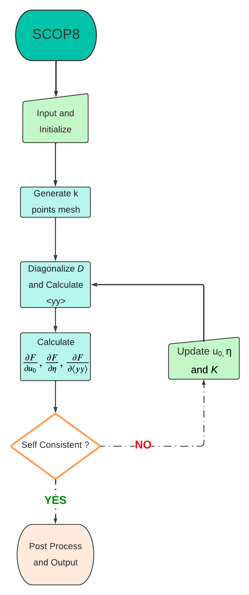

Running SCOP8
=============

.. Self-CoOnsistent Phonon (SCOP8)
.. --------------------------------------
.. role:: raw-math(raw)
  :format: latex html

.. only:: html
  :math:`\\require{mediawiki-texvc}`

Workflow of SCOP8
-----------------
The workflow of the SCOP8 code is outlined below to provide a general overview of its structure and execution as a black box. While many intermediate steps in this process may not be essential for running the code, those that are critical are highlighted in the workflow diagram and subsequently explained in detail.

Description of input and output files
-------------------------------------

* **Preparing input files**

	In order to run SCOP8, you need 9 or 10 files (depends on the choice).
	
	The first group of input file(s) required to run SCOP8 are ``default.params`` and ``dielectric.params``.
	Those are simply the same input file(s) required to run FOCEX, they should be kept consistent with the FOCEX run. Refer to 'Running FOCEX' for further details about these files.
    
	The second group of input file(s) required to run SCOP8 are ``structure.params``, ``lat_fc.dat``, ``fc2.dat``, ``fc3.dat`` and ``fc4.dat``.  
	Those are generated from running FOCEX beforehand, they are raw input and should be left as is. Refer to 'Running FOCEX' for further details about these files.

	The third group of input file(s) required to run SCOP8 are ``control.params``, ``params.phon``, ``kpbs.params`` and ``targetInitialize.dat``(depends)
	Those are input files that uniquely for SCOP8 and can be customized by users, further details will be explained below

	A sample of input files can be found in the subfolder ``input_sample`` inside the SCOP8 folder.
 
	* **control.params**

	The control.params is main 'control file' with several options.

	.. code-block:: python

		.False. # whether to start with random value for variational parameter strain tensor and atomic displacements. 
		.True. # whether to inherit previous running result. If set to 'True', this means that this run will start with variational parameters values from the file 'targetInitialize.dat'. So be sure to have this file in current path while turning this option on.
		.False. # whether include pressure factor, the stress tensor matrix can be customized in line 12 13 & 14
		.False. # whether force ASR in K after each Broyden iteration. This option should generally be left off since acoustic sum rule should be automatically preserved in K given proper input fc2, fc3 and fc4 values.
		.False. # whether use high temperature limit in <YY> calculation when dealing with soft modes. If this is turned on, the default strategy of manually shifting all negative eigenvalues up will be skipped, instead the high temperature limit will be employed for and only for negative eigenvalues.
		54321 # only matters if set the 1st line to .True., if you want random start, this is the seed
		0.02 # only matters if set the 1st line to .True., range for random start
		0.0 0.0 0.0 # only matters if set the 1st line to .True., center for random start
		300 # max_iteration number
		-0.006 # pmix parameter here, usually -0.006
		10 # temperature in Kelvin
		25 0.0 0.0
		0.0 25 0.0 
		0.0 0.0 25 # set stress tensor, 'pressure' flag hard coded
		3 #this is the number of variational parameters you want to fix, this number can be set to negative, then it means how many of variational parameters you want to free
		1 2 3 #variational parameters indexes list that you want to be fixed/free, the total number of indexes should match the value above

	*  **params.phon**

	The ``params.phon`` is another control file but mostly deprecated. The only really meaningful line is the first line which defines the size of k point mesh.
	This file contains also parameters for DOS calculation.

	.. code-block:: python

		18 18 18   .false.   kmesh  , if true calculate only dos-bs
		1 6    # lamin,lamax
		0 0 0 0.5 0.5 0.5 2300 0.1300 0.4000    # shift_xyz, (fine mesh in IBZ) 0<sx<sy<sz
		300  5    # wmesh and wmax (in cm^-1)
		4.0  10.0     # width of gaussian broadening for DOS (in cm^_1), imaginary part of omega(lifetimes)
		1d-11      # tau0(s)  added to the inverse of the relaxation time
		.false.    # verbosity
		0 0 0      # wshift in 3 directions; it pushes the phonon frequencies up
		380 380 1    # tmin, tmax, ntemp
		1   0  0  0 # iterative_BTE,readv3,usetetra: read/write if it is=1; collect if it's 2 ; use svd
		1             # ncpu;  below is path to v33sq.dat files  
		/
		100 4    # max_iter, n_dig_accuracy, deprecated
		0.00000001  #v3_threshold, used for checking, deprecated
		0      # 1 for classical and 0 for quantum, deprecated
		0 0 0 0     # for cross setion if=1
		0      # for the 3-phonon matrix elt if=1
		1      # scale length

	* **kbps.params**

	The ``kpbs.params`` file define the q-point path for band dispersion plot. 

	.. code-block:: python

		0 # The first line can be set to 0 or 1 where 0 means conventional lattice and 1 means primitive lattice. 
		40 # The second line is the number of k points along each direction
		7 # The third line is the number of directions for the band plot.
		G 0 0.0001 0.0001 # The following lines should be input with format of special q point label(G, K, L, X, etc) followed by its 3d coordinates.
		K 0 0.75 0.75  
		X 0 1 1  
		G 0.9999 1 1    
		L 0.5 0.5 0.5 
		W 0. 0.5 1  
		X 0 0 1   
		G 0 0. 0.0001    gamma 

	* **targetInitialize.dat**

	This is the main output file that lists final values for all the variational parameters. It also serves as a customizable input file if user choose to set the 2nd line of control.params to True.

	.. code-block:: python

		0.0000000000000000        0.0000000000000000        0.0000000000000000     # the 'relaxed' tau_0, usually (0,0,0) since the center atom is fixed and used as a reference point
		7.3258075924813355E-011   7.3241067962641583E-011   7.3225737274375089E-011 # the 'relaxed' tau_1, if the lattice has more than two atoms (types), there will be more lines below
		9.7839998026831273E-004   3.2204510841042777E-012   3.2167153648262385E-012 # the 1st row of 'relaxed' strain tensor a.k.a eta_xx, eta_xy, eta_xz
		3.2204510841042777E-012   9.7839998014266562E-004   3.2126854822356125E-012 # the 2nd row of 'relaxed' strain tensor a.k.a eta_yx, eta_yy, eta_yz
		3.2167153648262385E-012   3.2126854822356125E-012   9.7839997972007462E-004 # the 3rd row of 'relaxed' strain tensor a.k.a eta_zx, eta_zy, eta_zz
		1           1           1           1           1   11.484396453112186   # this line and all the lines below corresponds to trial force constants, the columns are: index, atom_1, xyz_1, atom_2, xyz_2, K  
		2           1           1           2           2   11.484396453112325     
		3           1           1           3           3   11.484396453113003     
		4           2           2           1           1   11.484396453112071     
		5           2           2           2           2   11.484396453112852     
		6           2           2           3           3   11.484396453113003     
		7           1           2           1           1  -2.8395049908152701     
		8           2           1           1           1  -2.8395049908151790     
		9           1           2           2           2  -2.8395049908153513     
		10           2           1           2           2  -2.8395049908153425     
		11           1           2           3           3  -2.8395049908153900
		...
		23312           2         839           3           3   0.0000000000000000     
		23313           1        1160           2           2   0.0000000000000000     
		23316           2         817           2           2   0.0000000000000000     

* **Explaining output files**

	Most of the output files can be ignored, since they are for checking or logging, or simply legacy output that should be deprecated.
	Import output files will be briefly explained below.
	A sample of output files can be found in the subfolder ``output_sample`` inside the ``SCOP8`` folder.

	* **convergence.dat** 
	This file keeps a record of free energy value and L1 norm of all gradients at each iteration. So you can monitor how well the Broyden loops converge.

	.. code-block:: python

 		iteration,  free energy,                L1 norm    
			1 ,   7.7695601608371171E-003 ,  0.12192370206947493     
			2 ,   5.4742390823587731E-003 ,  0.12192370153985427     
			3 ,   1.9890803839332921E-003 ,  0.12192370154367714     
			4 ,   2.0003365953782347E-003 ,  0.12192370105296366     
			5 ,   1.0012513345730565E-005 ,  0.12192370105384057     
			6 ,   9.8580778483004610E-006 ,  0.12192370105387422     
			7 ,   9.8873791186356400E-006 ,  0.12192370104103692     
			8 ,   2.8162657844481114E-007 ,  0.12192370104041715     
			9 ,   1.8986235130117904E-007 ,  0.12192370104011624     
			10 ,   1.5464059224802259E-007 ,  0.12192370104020522     
			11 ,   1.0357871383178676E-007 ,  0.12192370104049430     
			12 ,   1.7166077234971523E-008 ,  0.12192370104056582     
			13 ,   5.7005150331804107E-009 ,  0.12192370104059483     
			14 ,   5.4702303408328802E-009 ,  0.12192370104113985     
			15 ,   6.7558572080945439E-011 ,  0.12192370104115086     

	* **Dispersion.dat**

	This file is for ploting the phonon dispersion as the file name suggests. Simily we have output files like ``dos_gauss.dat``, ``dos_tet.dat``, etc for the corresponding plot purposes.

	.. code-block:: python

	  q point index, band1, band2, band3, ... 
		1   2.9242458690853157E-003   2.9426593567020258E-003   2.9426606011758892E-003   15.200445394847394        15.200445395546224        15.200445395547092     
		2  0.26453273368343705       0.29992250241135027       0.46473813700486238        15.193704422889539        15.194830030019409        15.197208518698289     
		3  0.52727363740652622       0.59778066306805544       0.92753330396543299        15.173806732746305        15.178012413287949        15.187544762083835     
		4  0.78652244152886719       0.89163644909276552        1.3865038106147869        15.141710311252552        15.150076991747932        15.171592760596656     
		5   1.0406193052774069        1.1796769554150286        1.8398093401632922        15.098953274317608        15.111161267282284        15.149577082937030     
			...
		298   3.1829648451308912        3.2047348694808524        11.097412640591298        12.194293467387048        14.469149408840680        14.472597987374058     
		299   3.1756241291339333        3.1811019189677405        11.104582714239395        12.197751480924026        14.473360701151645        14.474226063172505     
		300   3.1731715122948594        3.1731715122953355        11.106976501294767        12.198906836802358        14.474768794358322        14.474768794359123     

	* **eigenvalues.dat**

	This file usually will print nothing unless there are negative eigenvalues a.k.a soft modes. 

	* **GradientF.dat**

	This file is the history of every variational parameter values and its free energy gradients values at every iteration, the FinalGradientF.dat is just these of the last iteration for convenience, since GradientF.dat is usually a large file with too many iterations.

	.. code-block:: python

		# the file serves as a logfile, so it's well printed and self-explainary. It looks like this below:
		current interation #:           1
		temperature=   40.000000000000000     
		F0= ( 0.12152291457977416     ,  0.0000000000000000     )
		V0= (  6.0941496242618617E-002,  0.0000000000000000     )
		free energy=  0.12192370398307743     
		=============GradientF:trial fc2====================
		largest gradient=    3.7915793395093544E-004
		||Atomic deviation u_tau(:)||
				1 x variable=   0.0000000000000000       gradient=   2.9773399986220660E-011   FIXED   
				1 y variable=   0.0000000000000000       gradient=   2.9774619876295032E-011   FIXED   
				1 z variable=   0.0000000000000000       gradient=   2.9774363665769146E-011   FIXED   
				2 x variable=   6.4873485806078854E-011  gradient=  -2.9773398395431535E-011   FREE    
				2 y variable=   6.4873383295777969E-011  gradient=  -2.9774613452670168E-011   FREE    
				2 z variable=   6.4873468950255914E-011  gradient=  -2.9774355445975634E-011   FREE    
		||Strain Tensor||
		xx variable=   1.2673966516492396E-003  gradient=  -3.7584995895641470E-004   FREE    
		xy variable=  -4.1761063898985007E-011  gradient=  -5.5646293115543233E-011   FREE    
		xz variable=  -4.1761065621560632E-011  gradient=  -5.5646710083691172E-011   FREE    
		yx variable=  -4.1761063898985007E-011  gradient=  -5.5646293115543233E-011   FREE    
		yy variable=   1.2673966546147906E-003  gradient=  -3.7584990147655333E-004   FREE    
		yz variable=  -4.1761040526752187E-011  gradient=  -5.5642905807692281E-011   FREE    
		zx variable=  -4.1761065621560632E-011  gradient=  -5.5646710083691172E-011   FREE    
		zy variable=  -4.1761040526752187E-011  gradient=  -5.5642905807692281E-011   FREE    
		zz variable=   1.2673966451871321E-003  gradient=  -3.7585008745702762E-004   FREE    
		||Force Constants||
				1 x           1 x variable=   13.135477166947316       gradient=   3.7915789332831906E-004   FREE    
				1 y           1 y variable=   13.135477166947151       gradient=   3.7915787513753685E-004   FREE    
				1 z           1 z variable=   13.135477166951206       gradient=   3.7915793392784281E-004   FREE    
				2 x           2 x variable=   13.135477166947448       gradient=   3.7915789326081750E-004   FREE    
				2 y           2 y variable=   13.135477166947071       gradient=   3.7915787517572852E-004   FREE    
				2 z           2 z variable=   13.135477166951164       gradient=   3.7915793395093544E-004   FREE    
				...
		...
		...
		current interation #:           999
		...

	* **FinalGradientF.dat**

	This is basically the last part of the previous file, for a quick look at what the final results are.

	* **output.txt** and **logfile.txt**

	These two files contain runtime info that only should be referred when try to debug the code. Otherwise ignore them.

	* **result.txt**

	This file contains most post-process results, such as final free energy, gruneisen, specific heat and elastic constants.
	It might look different as more post-process subroutines can be added later on.
	Some thermodynamics properties of interest might also be printed out in result.txt

	.. code-block:: python
		
		first Unpertubed Free Energy F0= ( 0.12152291457977416     ,  0.0000000000000000     )
		final translational vector =   0.0000000000000000        2.6988099999999999        2.6988099999999999        2.6988099999999999        0.0000000000000000        2.6988099999999999        2.6988099999999999        2.6988099999999999        0.0000000000000000     
		final F0 =  ( 0.12152325743018681     ,  0.0000000000000000     )
		final Free Energy F=F0+<V-V0> =  ( 0.12192370104115086     ,  0.0000000000000000     )
		Temperature   40.000000000000000     
		Current Volume is:   39.464183071187328     
		my calculated gruneisen: -0.94758846679605901     
		my calculated specific heat:   1.4541875815899401      
		my calculated bulk modulus:  0.66968252261197314     
		calculated beta =   -1.0806246818743969E-006
		elastic
		-7.2854364387643216       -5.3617679414071420       -5.3617679414070265        8.8636066792102938E-009   1.2069888990825881E-009   1.2068871752796343E-009
		-5.3617679414070869       -7.2854364387640818       -5.3617679414068569        1.2068554253301697E-009   8.8636579568164597E-009   1.2068605589486403E-009
		-5.3617679414071437       -5.3617679414070549       -7.2854364387640889        1.2069699917876204E-009   1.2069495447408507E-009   8.8635875559109161E-009
		-8.3631174514409110E-009  -4.7071115546290751E-009  -4.7071123636814083E-009  -14.881121710429831        1.2393144638154903E-010   1.2404539918885701E-010
		-4.7070043759087784E-009  -8.3630394947033851E-009  -4.7070017343739520E-009   1.2392663922588006E-010  -14.881121710429678        1.2398792816686518E-010
		-4.7071008543127752E-009  -4.7070844606782160E-009  -8.3632129559818321E-009   1.2406723758800231E-010   1.2405596603844226E-010  -14.881121710429220     

		compliance
		-1.3082394889446023       0.55462664638390591       0.55462664638388204       -6.8925908783530570E-010   2.6922679641009340E-010   2.6922979880380062E-010
		0.55462664638390735       -1.3082394889446218       0.55462664638385151        2.6923738137719943E-010  -6.8925938322747944E-010   2.6923313072073446E-010
		0.55462664638388670       0.55462664638387926       -1.3082394889446018        2.6922303958373513E-010   2.6923172291170923E-010  -6.8926030193366936E-010
		3.8435147375417462E-010  -7.3318969926278909E-011  -7.3318868646515789E-011 -0.24081093946118309       -2.0054972257712852E-012  -2.0073412455396363E-012
		-7.3321363602604091E-011   3.8435273817860167E-010  -7.3321694278298720E-011  -2.0054194348880938E-012 -0.24081093946118556       -2.0064112315912288E-012
		-7.3322430162109725E-011  -7.3324482369402487E-011   3.8436130858012292E-010  -2.0076946413059313E-012  -2.0075122415880799E-012 -0.24081093946119300     

* **Explaining code files**

	* **test.cbp**

	This is the code::blocks project file that contains dependency and so on, only for Windows. 
	It should be ignored unless you need to modify the code files on Windows using the code::blocks IDE.

	* **main.f95**

	This is the main program file, read the comments, lots of lines of codes can be turned on or off for multiple-purpose calculations by users.

	* **Broyden.f95**

	This is the root finding module that utilizes Broyden's method.

	* **check.f90**

	This contains several test subroutines, including free energy landscape calculations, but mostly can be deprecated.

	* **ConjugateGradient.f90**

	This is the root finding module that utilizes conjugate gradient method, currently not in use and may need to be modified before it can be compatible with the current version of SCOP8 main code.

	* **DFT_force_constants.f95**

	This declare force constants objects, allocate them and read info from fc#.dat files.

	* **extratools.f90** 

	This is the legacy code contains various utility functions.

	* **force_constants.f90**

	Legacy codes that mostly from FOCEX. Crucial for the input read.

	* **force_update.f90**

	This is a module written in 2020 summer mostly contains updating scheme subroutines(which are based on wrong methodology), the useful subroutines for now are those with ASR checking and ASR fixing. This file may be deprecated in the future and integrated into other files.

	* **Fourier_force_constants.f95**

	This is a small module that mainly used for Fourier transform force constants. 

	* **geometry.f95**

	This file contains various constants, math operation interfaces, etc.

	* **Iteration_parameters.f95**

	This file is linked with the input file ``control.params``. It also declare variational parameters, allocate and initialize them, while reading important parameters such as loop control, temperature, etc from ``control.params``.

	* **kp_1d.f90**

	This is legacy code that relates with k mesh, should be combined into other module in the future.

	* **MatrixDiagonalize.f90**

	This file contains modified legacy code that performs matrix diagonalization.

	* **mods9.f90** & **others3_nshells.f90**

	Legacy codes compilation. 

	* **modules_tetra.f90**

	This is a module for tetrahedron method k mesh generation.

	* **Structure_info.f95**

	This file declares atom and structure related object, allocate and initialize them, also read parameters from legacy input files lat_fc.dat, params.inp, etc.

	* **VA_math.f95**

	This is the major code file that contains an important module for variational approach, contains subroutines for free energy and its gradients calculation and many others.
	The new and old math regarding whether to couple :math:`\eta` with <yy> can be switched between subroutine 'GetV_avg_And_GradientV_avg2' and 'GetV_avg_And_GradientV_avg'

	* **Files dependency**

	In order for users to have a general idea of how the code files are connected, below is a file dependency chart for reference.

	.. image:: Ref/SCOP8_Dependencies.png
		:width: 1000

Example
-------

As an example run, dump all the files from ``input_sample`` into the folder that has all the code files.

* **Run code in Linux**

Type ``make`` in terminal for the code to compile. After compilation, type ``mpiexec -np X ./out.exe``, replace X by an integer, it means how many cores you want the code running on. Genrally a large number will significantly accelerate the computation speed but turns out to be more unstable.

* **Run code in Windows(updated)**

	1.Install Visual Studio Code `download here <https://code.visualstudio.com/download>`_.  This is strongly recommended as it is most commonly used and supported 'all-in-one' code development environment for Windows by Microsoft community. Coding in C++, Python, Java, Fortran,...etc can be switched to and from with one click inside the IDE. VScode can also be integrated with Git, MinGW bash, WSL for Linux subsystem, SSH-remote connection, Jupyter Notebook, PDF Reader and more via powerful optional extensions.

	2.Install the latest MinGW `download here <https://sourceforge.net/projects/mingw/>`_.  Assume this is installed on C drive and beware that you may later need to download extra package via 'mingw-get', which is located in C:\MinGW\bin\mingw-get.exe

	3.Add MinGW to the system environment by:  Open control panel > system advanced settings > add path of "C:\MinGW", see below

	.. image:: Ref/how.jpg
		:width: 1000

	4.Setup Fortran environment with VScode:

		* Install 'Modern Fortran' extension `download here <https://marketplace.visualstudio.com/items?itemName=fortran-lang.linter-gfortran>`_.  or press `Ctrl+Shift+X` in VScode and search for 'Modern Fortran'. There are also some useful extensions such as 'TODO Highlight'

		* Integrate msys bash(1.0) for compiling and running the code (assuming you installed MinGW in C:\MinGW):

			* Create a file `Run_MSYS.bat` in C:\MinGW\msys\1.0\, copy and paste the script below into the file

			.. code-block:: powershell

				@rem Do not use "echo off" to not affect any child calls.
				@SETLOCAL
				@SETLOCAL ENABLEEXTENSIONS

				:: Figure out where msys's root folder. If you want, you could just add the folder in the line
				:: below.
				@set MSYSROOT=
				@if "x%MSYSROOT%"=="x" @if exist "%~dp0msys.bat" @set MSYSROOT=%~dp0
				@if "x%MSYSROOT%"=="x" @if exist "%~dp0.msys-root" @set /P MSYSROOT=<%~dp0.msys-root
				@if "x%MSYSROOT%"=="x" (
				@echo Could not locate your mysys root folder.
				@set /P MSYSROOT=Location:
				)
				:: Read as MSYSROOT.trim()
				@if not "x%MSYSROOT%"=="x" (
				@for /f "tokens=* delims= " %%a in ("%MSYSROOT%") do @set MSYSROOT=%%a
				@for /f "useback tokens=*" %%a in ('%MSYSROOT%') do @set MSYSROOT=%%~a
				@if not "%MSYSROOT:~-1%"=="\" @set MSYSROOT=%MSYSROOT%\
				)
				:: Verify that root folder exists
				@if not exist "%MSYSROOT%" (
				@echo "%MSYSROOT%" is not a valid folder. Please check for .msys-root in %~dp0, or if you entered the path above, please rerun this script and select a valid folder.
				@exit /B 1
				) else (
				@if not "%MSYSROOT%"=="%~dp0" @echo %MSYSROOT%>%~dp0.msys-root
				)

				:: Home Folder
				:: If you'd prefer the home directory set to your C:\Users\Username folder, uncomment the two lines
				:: below.
				@rem @if not exist "%HOME%" @set HOME=%HOMEDRIVE%%HOMEPATH%
				@rem @if not exist "%HOME%" @set HOME=%USERPROFILE%
				@if not exist "%HOME%" @if not "%MSYSROOT%"=="" @set HOME=%MSYSROOT%home\%USERNAME%
				@if not "x%WD%"=="x" @set WD=
				@set PLINK_PROTOCOL=ssh
				@if not exist "%WD%msys-1.0.dll" @set WD=%MSYSROOT%\bin\
				@set MSYSCON=sh.exe

				:: Default action, open msys and go to the current folder.
				@set OLDCD=%CD%
				@if not "x%OLDCD%"=="x" @set CURRCD=%CD%
				:: Get the current console ("OEM") codepage.
				@for /f %%i in ('"%MSYSROOT%bin\getcp.exe" -oem') do @set cp_oem=%%i
				:: Get the current GUI ("ANSI") codepage.
				@for /f %%i in ('"%MSYSROOT%bin\getcp.exe" -ansi') do @set cp_ansi=%%i
				:: Set the console codepage to match the GUI codepage.
				@chcp %cp_ansi% > nul < nul
				@if not "x%OLDCD%"=="x" (
				@"%MSYSROOT%bin\bash.exe" -l -i -c "cd \"$CURRCD\"; exec /bin/bash -rcfile ~/.bash_profile"
				) else (
				@"%MSYSROOT%bin\bash.exe" -l
				)
				:: Store the error level returned by bash.
				@set ErrorLevel=%ErrorLevel%
				:: Restore the original console codepage.
				@chcp %cp_oem% > nul < nul
				:: If we had a current directory at the store of the script, go back to it.
				@if not "x%OLDCD%"=="x" chdir /D "%OLDCD%"

				:: quit script with the current error level.
				@exit /b %ErrorLevel%

			
			* Download `getcp.exe`  `download here <https://github.com/msysgit/msysgit/tree/master/mingw/bin>`_.  and put it into C:\MinGW\msys\1.0\bin

			* Open VScode and press `Ctral+Shift+P`, type 'setting' and find the 'Open User Setting(JSON)' to open the `settings.json` file, add following lines

			.. code-block:: powershell

				"terminal.external.windowsExec": "C:\\MinGW\\msys\\1.0\\bin\\sh.exe"

	5.Setup for MPI in Windows follow the steps  `here <https://abhila.sh/writing/3/mpi_instructions.html>`_.   

	6.Compile and Run the code:

		* Open 'Developer Command Prompt for VS 2022', direct to the SCOP8 folder on your local machine

		* Type `code .` NOTICE: this should be the only way to open VScode

		* Press ` Ctrl+Shift+` ` to open the terminal window (remember to select 'msys' in the dropdown menu since the default terminal is windows powershell). If previous steps are executed correctly, the terminal should be opened in current directory, where you can input following command to compile and run the code.

		.. code-block:: powershell

			gfortran -c constants.f90

			gfortran -c geometry.f95

			gfortran -c force_constants.f90

			gfortran -c zhegv.f

			gfortran -c mods9.f90

			gfortran -c MatrixDiagonalize.f90

			gfortran -c modules_tetra.f90

			gfortran -c extratools.f90

			gfortran -c Structure_info.f95

			gfortran -c DFT_force_constants.f95

			gfortran -c kp_1d.f90

			gfortran -c others3_nshells.f90

			gfortran -c Fourier_force_constants.f95

			gfortran -c Iteration_parameters.f95

			gfortran -c mpi_params.f95

			gfortran -c Broyden.f95

			gfortran -c VA_math.f95

			gfortran -c force_update.f90

			gfortran -c check.f90

			gfortran -c ConjugateGradient.f90

			ar rcs libAll.a *.o

			gfortran -o out.exe main.f95 -IC:'\lib\mpi\include' -LC:'\lib\mpi\lib' -lmsmpi libAll.a libmsmpi.a

		* Execute use 'mpiexec', for example, if want to use 4 processes, input below (X is as stated above)

		.. code-block:: powershell

			mpiexec -np X ./out.exe

I do not recommend using this code in Windows environment, although it is developed in Windows.

* **Ge Example Results**

This is done with the sample input files for 2-atom cell Ge, and should be consistent with or directly using some of the FOCEX results.

Below are all the computation results from finite temperature 10K to 900K.

.. csv-table:: Ge free energy and more at finite temperature computation using SCOP8
   :header: "Temperature", "eta", "Volume", "Gruneisen", "Bulk", "Beta", "Elastic_C11", "Elastic_C12", "Elastic_C44", "SpecificHeat", "approx. LTE from eta", "Beta/3", "Bulk from my_bulk", "Bulk from C formula", "Beta_new"
   :widths: 8, 10, 10, 10, 10, 10, 10, 10, 10, 10, 12, 8, 12, 12, 10

   0,,,,,,,,,,,0.00E+00,,,
   10,8.63E-04,46.35325703,-0.4481168885,0.5484096126,-3.50E-08,131.67567,6.89E+01,3.72E+01,9.58E-02,,-1.17E-08,8.79E+01,89.36319268,-3.44E-08
   15,8.63E-04,46.35325703,-0.6841150614,0.5484125659,-2.59E-07,131.6758,6.89E+01,3.72E+01,4.65E-01,,,8.79E+01,89.3633061,-2.55E-07
   20,8.62E-04,46.35325703,-0.7887742581,0.5482510542,-7.68E-07,131.67517,6.89E+01,3.72E+01,1.19345843,-2.67E-07,-2.56E-07,8.78E+01,89.28357934,-7.55E-07
   25,8.61E-04,46.35325703,-0.7679261455,0.5484226435,-1.33E-06,131.67461,6.88E+01,3.72E+01,2.124211684,-4.95E-07,-4.43E-07,8.79E+01,89.3606233,-1.31E-06
   30,8.58E-04,46.35325703,-0.739197637,0.548430308,-1.87E-06,131.67299,6.88E+01,3.72E+01,3.100204446,-6.64E-07,-6.23E-07,8.79E+01,89.35723348,-1.84E-06
   35,8.55E-04,46.35325703,-0.6923446957,0.548442812,-2.28E-06,131.67136,6.88E+01,3.72E+01,4.047691629,-7.41E-07,-7.62E-07,8.79E+01,89.35361448,-2.25E-06
   40,8.51E-04,46.35325703,-0.6315039103,0.5484513368,-2.55E-06,131.66858,6.88E+01,3.72E+01,4.951309303,-7.22E-07,-8.50E-07,8.79E+01,89.34800317,-2.51E-06
   45,8.47E-04,46.35325703,-0.5600888994,0.54846009,-2.66E-06,131.66586,6.88E+01,3.72E+01,5.82024839,-6.73E-07,-8.86E-07,8.79E+01,89.34249679,-2.61E-06
   50,8.42E-04,46.35325703,-0.481988088,0.5484610592,-2.62E-06,131.66189,6.88E+01,3.72E+01,6.667396969,-6.07E-07,-8.73E-07,8.79E+01,89.33498794,-2.58E-06
   55,8.39E-04,46.35325703,-0.4012310197,0.548457608,-2.45E-06,131.65805,6.88E+01,3.72E+01,7.501718845,-4.98E-07,-8.18E-07,8.79E+01,89.32791534,-2.41E-06
   60,8.35E-04,46.35325703,-0.3213350532,0.5484430933,-2.18E-06,131.65284,6.88E+01,3.72E+01,8.326218899,-3.83E-07,-7.27E-07,8.79E+01,89.31876214,-2.15E-06
   65,8.32E-04,46.35325703,-0.2448441402,0.5484206226,-1.82E-06,131.64783,6.88E+01,3.73E+01,9.139661087,-2.36E-07,-6.08E-07,8.79E+01,89.31034086,-1.79E-06
   70,8.29E-04,46.35325703,-1.73E-01,0.5483850365,-1.41E-06,131.64134,6.87E+01,3.73E+01,9.938046134,-9.35E-08,-4.68E-07,8.79E+01,89.29971859,-1.38E-06
   75,8.28E-04,46.35325703,-1.08E-01,0.5483394431,-9.43E-07,131.63516,6.87E+01,3.73E+01,10.71653439,7.31E-07,-3.14E-07,8.79E+01,89.2901096,-9.28E-07
   80,8.27E-04,46.35325703,-5.01E-02,0.5481170117,-4.69E-07,131.39221,6.88E+01,3.73E+01,11.47032902,1.35E-06,-1.56E-07,8.78E+01,89.19966524,-4.62E-07
   85,8.27E-04,46.35325703,4.79E-03,0.5482096683,4.76E-08,131.62007,6.87E+01,3.73E+01,12.19541512,1.81E-06,1.59E-08,8.78E+01,89.26750656,4.68E-08
   90,8.27E-04,46.35325703,5.26E-02,0.5481256321,5.53E-07,131.61109,6.87E+01,3.73E+01,12.88878969,2.15E-06,1.84E-07,8.78E+01,89.2543674,5.44E-07
   95,8.29E-04,46.35325703,9.52E-02,0.5480309535,1.05E-06,131.6027,6.86E+01,3.73E+01,13.54842992,2.42E-06,3.51E-07,8.78E+01,89.24279829,1.04E-06
   100,8.31E-04,46.35325703,0.1334017055,0.5479232223,1.54E-06,131.5926,6.86E+01,3.73E+01,14.1733765,2.63E-06,5.14E-07,8.78E+01,89.22859455,1.52E-06
   150,8.94E-04,46.35325703,0.3526021711,0.5463150781,5.39E-06,131.47523,6.84E+01,3.73E+01,18.67313495,2.80E-06,1.80E-06,8.75E+01,89.0794465,5.29E-06
   200,1.00E-03,46.35325703,0.4391991685,5.44E-01,7.58E-06,131.32818,6.82E+01,3.74E+01,21.00961504,2.94E-06,2.53E-06,8.72E+01,88.90431128,7.44E-06
   250,1.14E-03,46.35325703,0.4810731993,5.41E-01,8.86E-06,131.16838,6.79E+01,3.74E+01,22.28955929,3.27E-06,2.95E-06,8.67E+01,88.72175503,8.66E-06
   300,1.30E-03,46.35325703,0.5331419931,0.5385197293,1.02E-05,130.99661,6.77E+01,3.74E+01,23.04733631,3.47E-06,3.40E-06,8.63E+01,88.52682158,9.94E-06
   350,1.47E-03,46.35325703,0.5213073677,0.5355080548,1.02E-05,130.82272,6.74E+01,3.74E+01,23.52727334,3.62E-06,3.41E-06,8.58E+01,88.3342433,9.95E-06
   400,1.64E-03,46.35325703,0.5338407529,0.5323888177,1.07E-05,130.64057,6.71E+01,3.74E+01,23.84853655,3.73E-06,3.56E-06,8.53E+01,88.13104494,1.03E-05
   450,1.82E-03,46.35325703,0.5410411737,0.5292028116,1.10E-05,130.46035,6.69E+01,3.74E+01,24.07322697,3.83E-06,3.67E-06,8.48E+01,87.93457448,1.06E-05
   500,2.01E-03,46.35325703,0.5474596268,0.5259463365,1.13E-05,130.27228,6.66E+01,3.74E+01,24.23625244,3.90E-06,3.76E-06,8.43E+01,87.7266281,1.08E-05
   550,2.20E-03,46.35325703,0.5531118165,0.5226546753,1.15E-05,130.08848,6.64E+01,3.74E+01,24.35801535,3.97E-06,3.84E-06,8.37E+01,87.52840224,1.10E-05
   600,2.39E-03,46.35325703,0.5574023146,0.519304411,1.17E-05,129.89625,6.61E+01,3.74E+01,24.45134171,4.04E-06,3.91E-06,8.32E+01,87.31707761,1.12E-05
   650,2.59E-03,46.35325703,0.561818001,0.5159373958,1.19E-05,129.71006,6.59E+01,3.73E+01,24.52431144,4.00E-06,3.98E-06,8.27E+01,87.118005,1.13E-05
   700,2.79E-03,46.35325703,0.5655035883,0.512513449,1.21E-05,129.51446,6.56E+01,3.73E+01,24.58248391,3.99E-06,4.04E-06,8.21E+01,86.903926,1.15E-05
   750,3.00E-03,46.35325703,0.5689788496,0.509086543,1.23E-05,129.32648,6.53E+01,3.73E+01,24.62951401,3.99E-06,4.10E-06,8.16E+01,86.70444611,1.16E-05
   800,3.20E-03,46.35325703,0.5723864668,0.5054382475,1.25E-05,128.89391,6.52E+01,3.73E+01,24.66812955,3.99E-06,4.16E-06,8.10E+01,86.40987962,1.17E-05
   850,3.41E-03,46.35325703,0.5755337678,0.5021212156,1.27E-05,128.93846,6.48E+01,3.73E+01,24.70015099,4.00E-06,4.22E-06,8.04E+01,86.28826934,1.18E-05
   900,3.62E-03,46.35325703,0.5787399793,0.4984155442,1.28E-05,128.50335,6.47E+01,3.73E+01,24.72705301,4.00E-06,4.28E-06,7.99E+01,85.99149908,1.19E-05

Below is a sample phonon dispersion plot for Ge at 80K

	.. image:: Ref/SCOP8_Ge_phonon.png
		:width: 1000

Below is a graph for multiple thermodynamics properties computations using SCOP8 at different temperatures.

	.. image:: Ref/SCOP8_merge_thermo.jpg
		:width: 1000

Below is a free energy landscape plot of 2 stress tensors variables, with additional pressure switched off and on at a finite temperature, using SCOP8.

	.. image:: Ref/SCOP8_merge_contour.jpg
		:width: 1000

